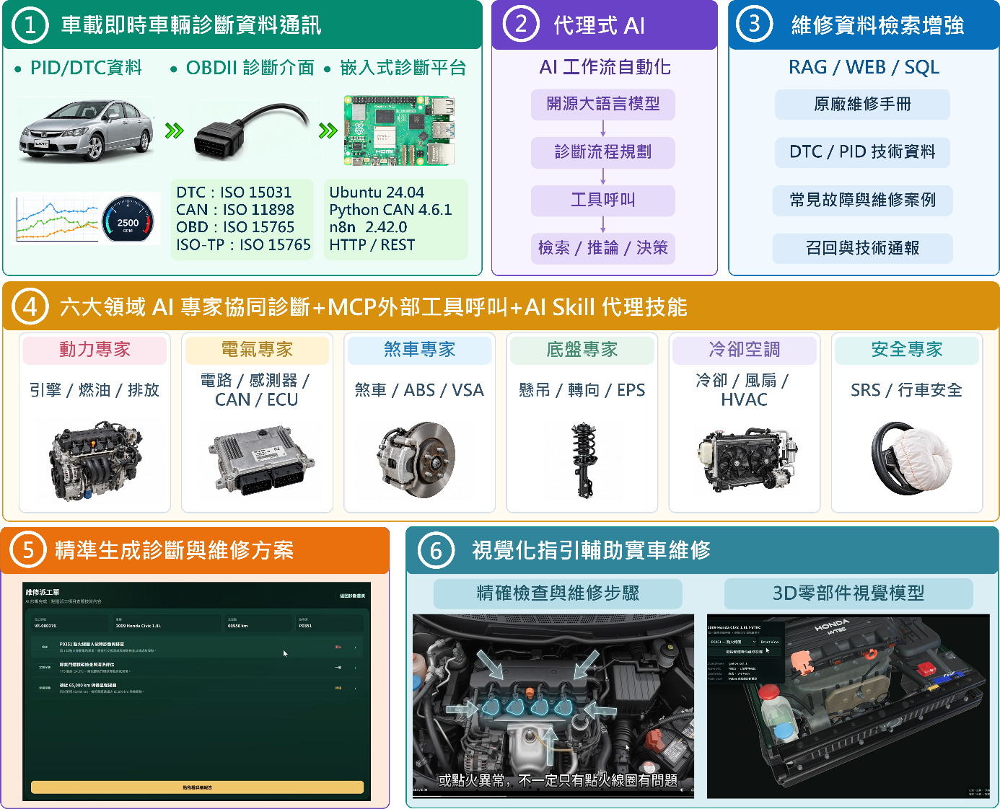

# 代理式人工智慧驅動之車輛診斷與修護系統

**Agentic AI-Driven Vehicle Diagnostics and Service System**

> 2026 第 31 屆大專校院資訊應用服務創新競賽｜指定專題類｜開源 AI 模型應用組（AI-Open Source）GitHub 公開版本。



## 專案目的

車輛故障資訊分散於 OBD-II/DTC/PID、維修手冊、技術資料、召回/TSB 與歷史維修紀錄，對經驗較少的技師形成明顯的**能力與資訊落差**。本專案使用開源 AI 模型與 Agentic AI 工作流，把「讀取車況 → 搜尋證據 → 專家分工 → 交叉驗證 → 維修工單」整合為一個可展示 Prototype，降低查找資料與建立故障關聯的門檻。

## 核心開源 AI 模型

- Model: `google/gemma-4-26B-A4B`
- Developer: Google DeepMind
- Model source: https://huggingface.co/google/gemma-4-26B-A4B
- Official model card: https://ai.google.dev/gemma/docs/core/model_card_4
- License: Apache-2.0
- Deployment: local inference through an OpenAI-compatible local endpoint (e.g. LM Studio); model weights are **not** committed to this repository.

本專案公開版本不使用中國（含中國大陸）機構、企業或研究單位所開發/維護的 AI 模型作為核心模型。完整揭露請見 [MODEL_DISCLOSURE.md](MODEL_DISCLOSURE.md)。

## 系統流程

```text
Vehicle / OBD-II CAN
        │
        ▼
Raspberry Pi OBD Reader ──► Web Diagnostic Case
        │                         │
        └────────► n8n AI Supervisor
                         │
               ┌─────────┼─────────┐
               ▼         ▼         ▼
              RAG       SQL     Expert Router
                                   │
        ┌──────────┬──────────┬────┼────┬──────────┬──────────┐
        ▼          ▼          ▼         ▼          ▼          ▼
   Powertrain  Electrical   Brake     Chassis  Cooling/HVAC  Safety
        └──────────┴──────────┴────┬────┴──────────┴──────────┘
                                   ▼
                         Diagnostic Work Order
                         + Repair Guidance / 3D
```

## 主要功能

- OBD-II / CAN Bus 取得 DTC、PID 與即時車況。
- AI 總監自主規劃診斷流程與專家路由。
- RAG 檢索維修資料、DTC/PID 技術資料、TSB、召回與案例。
- SQL 車輛歷史資料查詢作為輔助證據。
- 六大 AI 專家：動力、電氣電子、煞車、底盤、冷卻空調、安全。
- 產生故障原因、證據、檢查步驟、維修建議與完工驗證的派工單。
- 維修動畫與 3D 零件導引介面。

## Repository 目錄

```text
app/                 可執行程式
  obd/               SocketCAN/Kvaser OBD-II reader
  rag/               MCP Server、RAG ingestion、RAG sources
  history/           MySQL vehicle-history API
  web/               診斷網站與派工單 UI
database/            MySQL schema / seed
n8n/workflows/       已移除 credentials 的公開工作流 JSON
skills/              AI Supervisor / 六大專家 Skills
docs/                架構、部署、競賽符合性文件
deploy/              systemd 部署範例
.github/              GitHub issue templates
```

完整檔案說明見 [PROJECT_STRUCTURE.md](PROJECT_STRUCTURE.md)。

## 快速開始

1. Ubuntu / Raspberry Pi 建立 Python 3.12 virtual environment。
2. `pip install -r requirements.txt`。
3. `cp .env.example .env`，依實際環境填寫資料庫、n8n webhook 與本機服務設定。
4. 建立 MySQL database：匯入 `database/vehicle_history_schema.sql`，測試環境可再匯入 seed。
5. 將有合法使用權的維修文件放入本機 RAG source directory，執行：
   `python app/rag/ingest_rag.py --source-dir app/rag/rag_sources --db-dir app/rag/rag_db`
6. 啟動 OBD reader、history API、MCP server、n8n 與 web service。
7. 匯入 `n8n/workflows/*.json`，重新指定本機 LLM credential 與 expert sub-workflow。

詳細步驟請見 [INSTALLATION.md](INSTALLATION.md)。

## 公開版本安全處理

- n8n workflow 已移除 credential ID / credential name。
- `.env`、token、API key、資料庫密碼、SQLite runtime DB、OBD cases 與 model weights 均由 `.gitignore` 排除。
- 公開 repo 僅保留 `.env.example`。
- 建議 GitHub 開啟 Secret scanning、Push protection 與 Dependabot。

## 第三方資料與大型檔案

本 repository **不重新散布 Honda Owner/Service Manual PDF、AI 模型權重或大型競賽影片**。這些檔案不是執行程式碼的一部分，且可能有不同授權/著作權。詳細說明見 [THIRD_PARTY_NOTICES.md](THIRD_PARTY_NOTICES.md)。

## Prototype 與展示範圍

Prototype 以 Honda Civic 1.8L 測試平台為主要驗證場景，部署車型可透過環境變數設定。知識庫含 2008/2009 Civic 1.8L 相關診斷參考資料；實車配置以部署現場設定為準。

## 文件

- [競賽符合性](docs/COMPETITION_COMPLIANCE.md)
- [模型揭露](MODEL_DISCLOSURE.md)
- [安裝與部署](INSTALLATION.md)
- [專案目錄](PROJECT_STRUCTURE.md)
- [資料與授權](THIRD_PARTY_NOTICES.md)
- [安全政策](SECURITY.md)

## License

本團隊自行撰寫並放入本 repository 的程式與文件，除另有標示者外，以 MIT License 釋出。第三方模型、平台、資料與素材維持各自原始授權。
